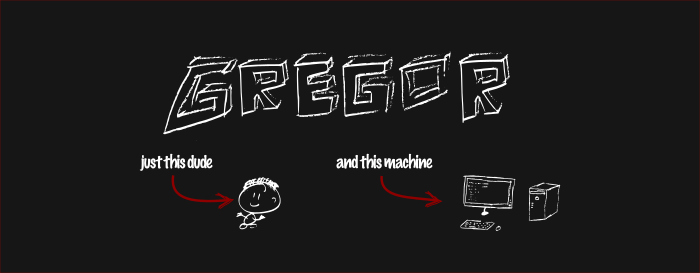

### 👋 Hey! Yep, that's me. Juuuust me.

This small JSON snippet contains the most important information about me:

```json
{
    "name": "Gregor Gottschewski",
    "programming_languages": [
        "Java", "Python", "JavaScript", "C"
    ],
    "interests": [
        "Cryptography", "Client-server systems", "JavaFX", "JAX-RS", "Jakarta EE", "PrimeFaces"
    ],
    "newest_project": "TonoJip (Java INI-parser library)",
    "currently_working_on": "A personal cloud server using JAX-RS and PrimeFaces",
    "contact": "gregorgott.software [AT] yahoo.com"
}
```
